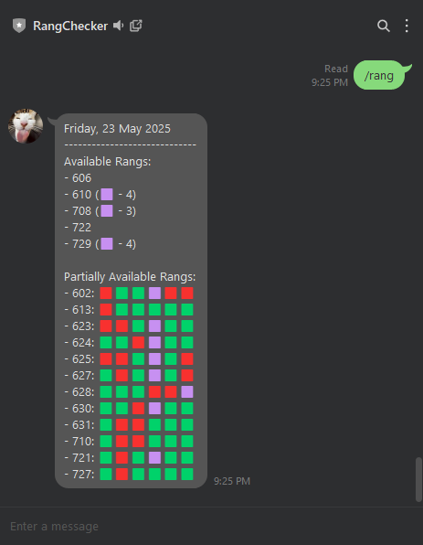

<a name="rangchecker-readme"></a>
# RangChecker - A LINE Chatbot for Real-Time Room Availability

[](https://www.python.org/)
[](https://flask.palletsprojects.com/)
[](https://developers.line.biz/)

A Flask-based chatbot for the LINE Messenger platform that provides real-time room availability summaries for university laboratory assistants.

**Project Status:** ✅ Complete

---

<a name="rangchecker-toc"></a>
## Table of Contents
* [Introduction: The Problem](#rangchecker-introduction)
* [The Solution: RangChecker Bot](#rangchecker-solution)
* [Features](#rangchecker-features)
* [Tech Stack](#rangchecker-tech-stack)
* [Getting Started](#rangchecker-getting-started)
  * [Prerequisites](#rangchecker-prerequisites)
  * [LINE Developer Setup](#rangchecker-line-setup)
  * [Local Installation](#rangchecker-local-installation)
* [Running the Bot Locally](#rangchecker-running)
* [Chatbot Commands](#rangchecker-commands)
* [License](#rangchecker-license)

---

<a name="rangchecker-introduction"></a>
## Introduction: The Problem

At the Software Laboratory Center, Junior Laboratory Assistants do not have a fixed office and rely on borrowing available lab rooms ("rangs") to work during their shifts. The official method for checking room schedules was a web application that was often inconvenient to access, especially since all team communication already happened on the LINE Messenger platform. This created a workflow inefficiency, requiring assistants to switch between apps just to find a place to work.

<a name="rangchecker-solution"></a>
## The Solution: RangChecker Bot

RangChecker is a simple but effective LINE chatbot built to solve this problem. By integrating directly into the assistants' primary communication platform, it allows them to check for available rooms with a simple command, right from their chat app.

The bot fetches real-time scheduling data from an internal university API, processes it to find rooms with long-enough availability streaks, and returns a clean, easy-to-read summary directly in the chat.



<a name="rangchecker-features"></a>
## Features

* **Real-Time Availability:** Connects to a private university API to fetch up-to-the-minute room scheduling data.
* **Smart Filtering:** Implements custom logic to define a "rang" as a room with at least 3 consecutive available shifts, filtering out rooms with only short, unusable gaps.
* **Intuitive Display:** Presents room availability in a clear, formatted message, using emojis (🟩, 🟥) to provide a quick visual summary of a room's daily schedule.
* **Special Case Handling:** Intelligently handles specific room statuses, such as "Calibration," treating them as available for assistants and noting it in the output (🟪).
* **Webhook Integration:** Securely receives messages from the LINE platform via a Flask-based webhook.

<a name="rangchecker-tech-stack"></a>
## Tech Stack

* **Backend:** Python, Flask
* **Chat Platform:** LINE Messaging API
* **Key Libraries:** `line-bot-sdk`, `requests`, `python-dotenv`

---

<a name="rangchecker-getting-started"></a>
## Getting Started

Follow these instructions to set up and run the chatbot on your local machine for development and testing.

<a name="rangchecker-prerequisites"></a>
### Prerequisites

* **Python:** Ensure you have Python 3.9 or newer.
* **ngrok:** You must have `ngrok` installed to create a public URL for your local server, which is required for the LINE webhook. You can download it from [ngrok.com](https://ngrok.com/).
* **LINE Account:** A personal LINE account to create a developer profile.

<a name="rangchecker-line-setup"></a>
### LINE Developer Setup

1.  **Create a Provider and Channel:** Go to the [LINE Developers Console](https://developers.line.biz/en/) and create a new "Provider." Within that provider, create a new "Messaging API" channel.
2.  **Get Credentials:** Navigate to your channel's "Messaging API" tab and find your **Channel Secret** and **Channel Access Token**.
3.  **Webhook Settings:** In the same tab, you will find the "Webhook settings." You will need to edit this in a later step.

<a name="rangchecker-local-installation"></a>
### Local Installation

1.  **Clone the repository:**
    ```bash
    git clone https://github.com/Remixingg/RangChecker.git
    ```

2.  **Create a virtual environment and install dependencies:**
    ```bash
    python -m venv venv
    source venv/bin/activate  # On Windows, use `venv\Scripts\activate`
    pip install -r requirements.txt
    ```

3.  **Configure Environment Variables:**
    Create a `.env` file in the root directory and add your credentials. The `ROOM_TRANSACTION_URL` is a private API and will not work externally, but the bot can still be run.
    ```env
    CHANNEL_ACCESS_TOKEN=YOUR_LINE_CHANNEL_ACCESS_TOKEN
    CHANNEL_SECRET=YOUR_LINE_CHANNEL_SECRET
    ROOM_TRANSACTION_URL=THE_PRIVATE_API_URL
    ```

<a name="rangchecker-running"></a>
## Running the Bot Locally

The bot requires a public URL to receive webhooks from LINE. We will use `ngrok` for this.

1.  **Start ngrok:** Open a new terminal and run `ngrok` to create a tunnel to your local port 5000 (the default port for the Flask app).
    ```bash
    ngrok http 5000
    ```
    `ngrok` will give you a public "Forwarding" URL (e.g., `https://random-string.ngrok-free.app`). Copy this HTTPS URL.

2.  **Update LINE Webhook:** Go back to your LINE Developers Console. In the "Webhook settings," paste your `ngrok` Forwarding URL and append `/line` to it.
    * **Example:** `https://random-string.ngrok-free.app/line`
    * Enable "Use webhook."

3.  **Run the Flask App:** In your original terminal (with the virtual environment activated), run the application.
    ```bash
    export FLASK_APP=run.py
    flask run
    ```
    The Flask server will start. Now, any message you send to your LINE bot will be forwarded by `ngrok` to your local application.

<a name="rangchecker-commands"></a>
## Chatbot Commands

* `/rang`: Fetches and displays the summary of fully and partially available rooms for the current day.
* `/hello`: A simple test command that replies with "Hello."

<a name="rangchecker-license"></a>
## License

This project is licensed under the MIT License.
